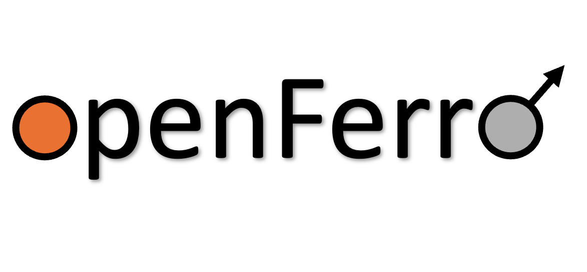
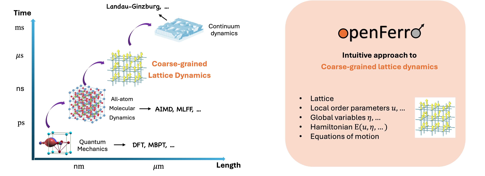
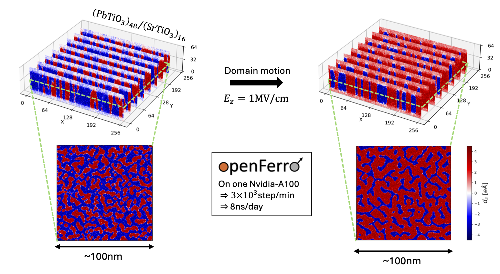
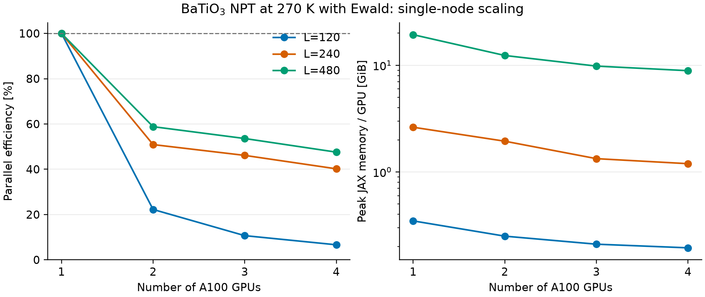

<p align="center">
  
</p>

# OpenFerro

A JAX-based framework for on-lattice atomistic dynamics.

OpenFerro 0.2.0 assembles lattice Hamiltonians from fields and interaction
energies, derives forces with automatic differentiation, and evolves real-valued
or fixed-magnitude order parameters with molecular-dynamics and
Landau-Lifshitz methods.

> [!IMPORTANT]
> OpenFerro is a research alpha. A callable API is not necessarily a
> scientifically validated API. Review the
> [feature-status matrix](docs/source/feature_status.rst) before using an
> engine, integrator, or distributed path for scientific production.

## Highlights

- **JAX execution** on CPU and NVIDIA GPU backends.
- **Automatic forces** from scalar, functionally pure energy engines.
- **Composable models** built from self, mutual, and triple interactions.
- **Flexible state** including scalar, real-vector, local/global strain, and
  fixed-magnitude three-vector fields.
- **Dynamics** through gradient descent, Leapfrog, LFMiddle Langevin, and
  semi-implicit B (SIB) Landau-Lifshitz integrators.
- **Experimental sharding** across multiple devices and hosts.

The exact geometry and field-count restrictions are documented in
[Feature Status](docs/source/feature_status.rst).

## Installation

OpenFerro 0.2.0 is installed from source and supports:

- Python `>=3.13,<3.15`
- JAX `>=0.10,<0.12`
- NumPy `>=2.0,<3`

Install the CPU build from the repository root:

```bash
python -m pip install .
python -c "import openferro as of; print(of.System)"
```

For editable development with tests:

```bash
python -m pip install -e ".[test]"
JAX_PLATFORMS=cpu python -m pytest tests/unit_tests -q
```

For NVIDIA GPUs, first install the JAX accelerator build appropriate for the
system, following the [official JAX installation guide](https://docs.jax.dev/en/latest/installation.html),
then install OpenFerro with `python -m pip install --no-deps .`. See the
[complete installation guide](docs/source/installation.rst) for details.

## Quick start

The public construction flow is lattice → system → fields → interactions →
integrators → simulation. This minimal example defines a harmonic vector field
and lets OpenFerro derive its force:

```python
import jax.numpy as jnp

import openferro as of


lattice = of.SimpleCubic3D(2, 2, 2)
system = of.System(lattice)
field = system.add_field("u", ftype="R3", value=(0.0, 0.0, 0.1))


def harmonic_energy(u, parameters):
    k = parameters[0]
    return 0.5 * k * jnp.sum(u**2)


system.add_self_interaction(
    "harmonic",
    field_ID="u",
    energy_engine=harmonic_energy,
    parameters=[2.0],
)
system.update_force()

print(system.calc_total_potential_energy())
print(field.get_force()[0, 0, 0])
```

Energy engines receive field values first and parameters last, remain free of
I/O and mutation, and return one scalar energy. OpenFerro JIT-compiles the
engine and obtains force as the negative energy gradient. Continue with the
[quick-start guide](docs/source/quickstart.rst) or the
[tutorial notebook](tutorials/quickstart.ipynb).

## Model structure

<p align="center">
  
</p>

A `System` combines:

1. a periodic Bravais lattice and its neighbor-shell geometry;
2. lattice fields such as local modes, dipoles, strains, or spins;
3. interaction wrappers around built-in or user-defined energy engines; and
4. simulation drivers, integrators, and reporters.

Real-valued inertial fields use gradient-descent, Leapfrog, or LFMiddle
integrators. Fixed-magnitude `SO3` fields use conservative, damped, or
stochastic SIB integration and are currently limited to one such field per
simulation. NPT dynamics treats engineering Voigt strain as a global field and
uses `V0 * det(I + eta)` as the default pressure volume.

## Maintained examples

| Example | Purpose | Status |
| --- | --- | --- |
| [`01.BTO_Cooling`](examples/01.BTO_Cooling) | BaTiO3 cooling with Ewald, local/global strain, minimization, and NPT Langevin dynamics. | Stable entry point |
| [`02.bcc_Fe_Heating`](examples/02.bcc_Fe_Heating) | Four-shell bcc Fe Heisenberg heating with stochastic SIB dynamics. | Stable entry point |
| [`03.sc_Ising_Heating`](examples/03.sc_Ising_Heating) | Simple-cubic continuous Heisenberg heating; the directory name is historical. | Stable entry point |
| [`04.PTOSTO_superlattice`](examples/04.PTOSTO_superlattice) | Single-GPU field-driven PTO/STO domain dynamics and visualization. | Runnable; superlattice engines experimental |
| [`05.BTO_GPU_Parallel`](examples/05.BTO_GPU_Parallel) | Reproducible single-node 1/2/3/4-GPU scaling at 270 K. | Experimental multi-device benchmark |

<p align="center">
  
</p>

## GPU benchmark

The current benchmark retains the full BaTiO3 Hamiltonian and measures
`L=120`, `240`, and `480` cells on one to four NVIDIA A100 GPUs. It records
timings, JAX allocator memory, software/hardware metadata, and derived
efficiency in CSV files. Scaling is strongly workload-dependent: small systems
do not amortize sharding and collective communication.

<p align="center">
  
</p>

See the [benchmark methodology and results](examples/05.BTO_GPU_Parallel/README.md).
These measurements are a reproducible reference for one machine and software
stack, not a general performance guarantee or a multi-device correctness
promotion.

## Model records

The JSON files under [`model_configs/`](model_configs) are documented parameter
records with provenance, units, conventions, and independently checked
reference observables. They are not inputs to a closed package-wide schema:
applications read the sections they need and map them to the ordinary OpenFerro
construction API. See [Model records](model_configs/README.md).

## Documentation and support

- [Documentation](https://openferro.readthedocs.io/)
- [API reference](https://openferro.readthedocs.io/en/latest/api.html)
- [Scientific conventions](docs/source/scientific_conventions.rst)
- [FAQ](docs/source/faq.rst)
- [Issue tracker](https://github.com/salinelake/OpenFerro/issues)

## Citation

Until a dedicated OpenFerro software paper or archival DOI is available, cite
the software repository with its version and access date:

> Pinchen Xie, *OpenFerro*, version 0.2.0, computer software,
> https://github.com/salinelake/OpenFerro.

Machine-readable metadata is provided in [`CITATION.cff`](CITATION.cff).

## Contributing and license

Contributions are welcome through issues and pull requests. OpenFerro is
released under the [MIT License](LICENSE). The initial development was by
Pinchen Xie with support from Lawrence Berkeley National Laboratory.

OpenFerro Copyright (c) 2025, The Regents of the University of California,
through Lawrence Berkeley National Laboratory (subject to receipt of any
required approvals from the U.S. Dept. of Energy). All rights reserved.

If you have questions about your rights to use or distribute this software, please contact Berkeley Lab's Intellectual Property Office at IPO@lbl.gov.

NOTICE.  This Software was developed under funding from the U.S. Department of Energy and the U.S. Government consequently retains certain rights.  As such, the U.S. Government has been granted for itself and others acting on its behalf a paid-up, nonexclusive, irrevocable, worldwide license in the Software to reproduce, distribute copies to the public, prepare derivative works, and perform publicly and display publicly, and to permit others to do so.