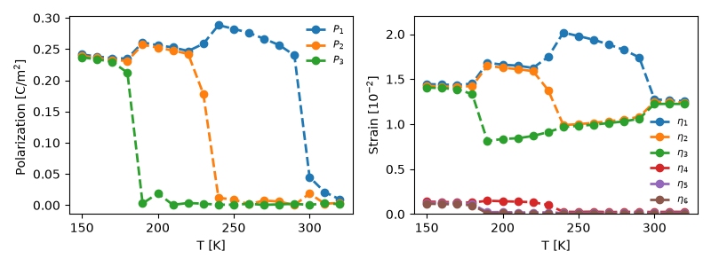

## Phase transition in BaTiO3

This example reads the documented `BaTiO3.json` effective-Hamiltonian record
with Python's standard JSON library and maps its parameters directly to
OpenFerro calls. The default run retains the 20x20x20 cell, pressure,
temperature schedule, time step, and sample counts used by the original
workflow.

Run from this directory or from the repository root:

```bash
python npt.py
python npt.py --tiny --output-dir /tmp/openferro-bto-smoke
```

`--tiny` uses a 2x2x2 cell, one minimization step, and one equilibration and
sampling step at 300 K. It is an execution smoke test, not a production result.
`--size`, `--seed`, `--config`, and `--output-dir` are also available. The
maintained config uses determinant pressure volume. Pass
`--pressure-volume linearized_small_strain` to reproduce the prior pressure
coupling without editing the config.

A paired single-GPU check used the same seed and initial state for determinant
and linearized `4x4x4` NPT trajectories at 300 K and -48 kbar. Over 800 samples
after 200 warmup steps, their mean physical volumes differed by 0.077%, their
mean strain components by at most `7.50e-4`, and their local-mode RMS by 0.53%.
This bounded regression supports consistency for a short trajectory; it is not
a phase-transition or thermodynamic-limit validation.

<p align="center" >
  
</p>
