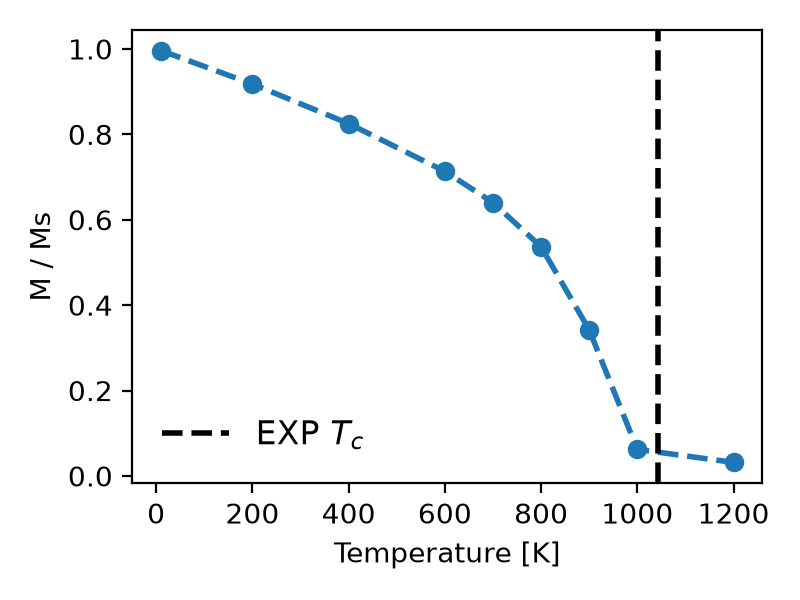

## Phase transition in bcc Fe

This example uses continuous fixed-magnitude spins and the four-shell
Heisenberg exchange parameters of Tao et al., Phys. Rev. Lett. 95, 087207
(2005). `bcc_Fe.json` records the paper's ordered-pair mRy values. This example
applies the documented conversion to OpenFerro's unique-undirected-bond
eV/mu_B^2 engine convention immediately before registering the interactions.

Run from this directory because the default configuration and output paths are
relative to the working directory:

```bash
python nvt.py
python nvt.py --tiny --output-dir /tmp/openferro-bcc-fe-smoke
```

The default run retains the original 20x20x20 cell and heating schedule.
`--tiny` performs one equilibration and one sampling step at 10 K on a 2x2x2
cell. `--size`, `--seed`, `--config`, and `--output-dir` are also available.

<p align="center" >
  
</p>
