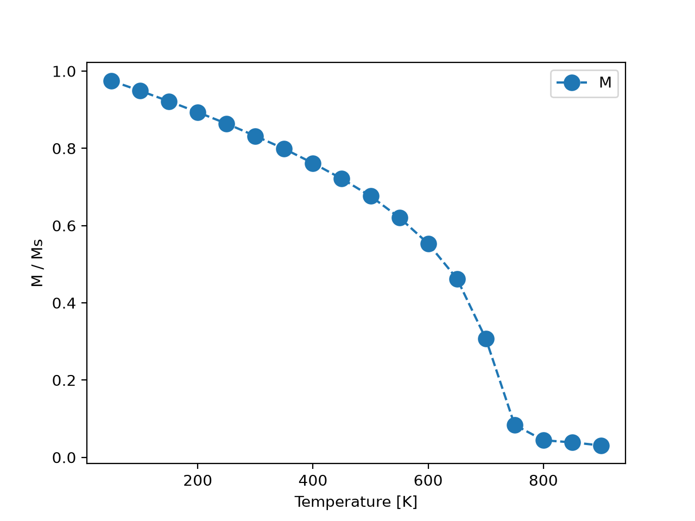

## Phase transition in a simple-cubic Heisenberg model

The retained directory name is historical. This example evolves continuous
fixed-magnitude SO(3) spins with isotropic dot-product exchange, so it is a
classical Heisenberg model rather than a discrete Ising model.

The exchange value `6.72e-21 J/link` comes from the
[official VAMPIRE Curie-temperature tutorial](https://vampire.york.ac.uk/tutorials/curie-temperature-simulation/).
Its unique-bond Joule-to-eV conversion is declared in `sc_Heisenberg.json` and
applied by a private helper in this example before interaction registration.

```bash
python nvt.py
python nvt.py --tiny --output-dir /tmp/openferro-sc-smoke
```

The default run retains the original 20x20x20 cell and 50-900 K schedule.
`--tiny` performs one equilibration and one sampling step at 700 K on a 2x2x2
cell. `--size`, `--seed`, `--config`, and `--output-dir` are also available.

<p align="center" >
  
</p>
