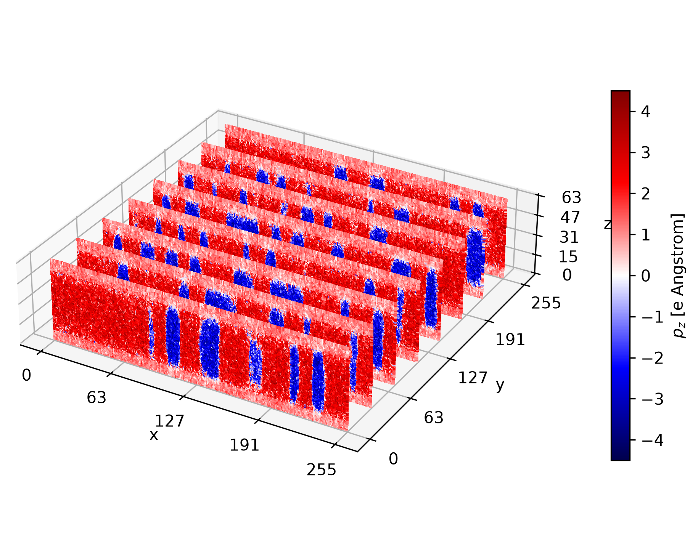

# Domain motion in a PTO/STO superlattice

This example simulates field-driven domain motion in a (PbTiO3)48/(SrTiO3)16
superlattice at 300 K. The default 256x256x64 cell retains the original model,
initial state, epitaxially fixed in-plane strain, 500 ps zero-field relaxation,
and 4000 ps trajectory under a 0.01 V/Angstrom field along z.

The local field is the physical dipole moment in e Angstrom. The onsite,
short-range, and strain-coupling parameters from
[`PbTiO3_SCAN.json`](../../model_configs/PbTiO3_SCAN.json) and
[`SrTiO3_WC.json`](../../model_configs/SrTiO3_WC.json) are therefore divided by
the appropriate powers of the Born effective charge. As in the legacy example,
STO homogeneous strain coupling is omitted and the PTO dielectric constant is
used by Ewald.

The production calculation is large. Submit the included Perlmutter batch
template with your project account and adjust its time limit if needed:

```bash
sbatch -A PROJECT submit.sh
```

For an interactive or reduced run, request one GPU:

```bash
salloc -N1 -n32 -t 04:00:00 -C gpu -q shared_interactive \
    --gres=gpu:1 -A m5218
cd examples/04.PTOSTO_superlattice
srun --ntasks=1 --gpus-per-task=1 python npt.py
```

This example intentionally uses one GPU and does not enable multi-device
sharding. Output is written under `output/`; full dipole fields are saved every
50,000 steps.

For a short execution check, explicitly request a 4x4x4 cell with one
relaxation step and one driven step:

```bash
python npt.py \
    --lateral-size 4 \
    --pto-layers 2 \
    --sto-layers 2 \
    --relax-time-ps 0.002 \
    --drive-time-ps 0.002 \
    --log-interval 1 \
    --dump-interval 1 \
    --seed 17 \
    --output-dir /tmp/openferro-ptosto-smoke
```

Plot any saved field rather than editing a hard-coded filename:

```bash
python plot.py output/drive_field_dump_1500000.npy \
    --output 3d_visualization.png
```

Animate all drive-stage dumps as synchronized cross-section and middle-PTO-
layer panels:

```bash
python animation.py
```

The animation is written to `output/drive_field.webm`. Use `--help` to adjust
the frame rate, output resolution, color range, or layer counts.

When plotting a dump from the reduced command, also pass `--sto-layers 2` to
`plot.py`. The image below is the reference visualization retained from the
original production calculation.

<p align="center">
  
</p>
