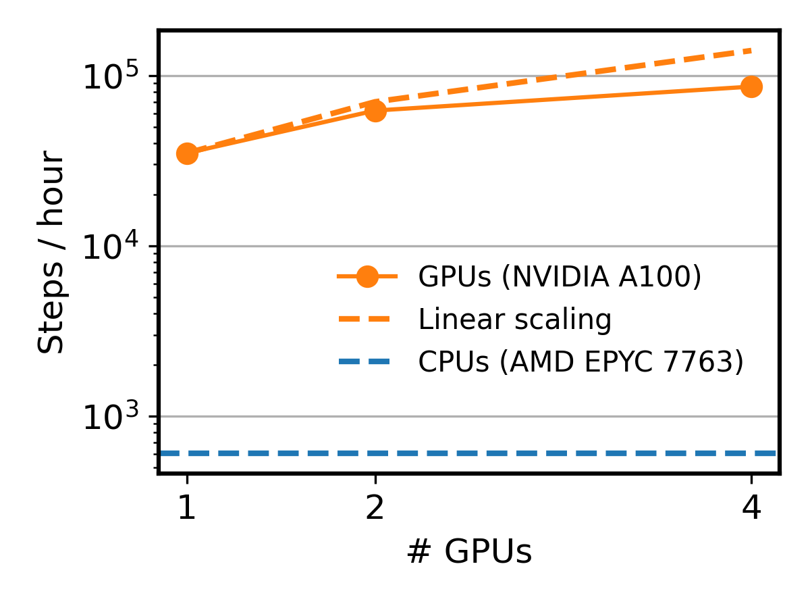

## Benchmarking multi-GPU acceleration

  

The benchmark is performed on a 256X256X256 lattice of BaTiO3, with the parameters from [Zhong, W., David Vanderbilt, and K. M. Rabe. "First-principles theory of ferroelectric phase transitions for perovskites: The case of BaTiO3." Physical Review B 52.9 (1995): 6301.]

The GPUs used in this benchmark are NVIDIA A100 in Della supercomputer at Princeton University, where one GPU node contains 4 GPUs.

The CPUs used in this benchmark is two AMD EPYC 7763 64-Core Processors in a CPU node of Perlmutter supercomputer at NERSC.

Here, a GPU node brings over 100X speedup compared to a CPU node.